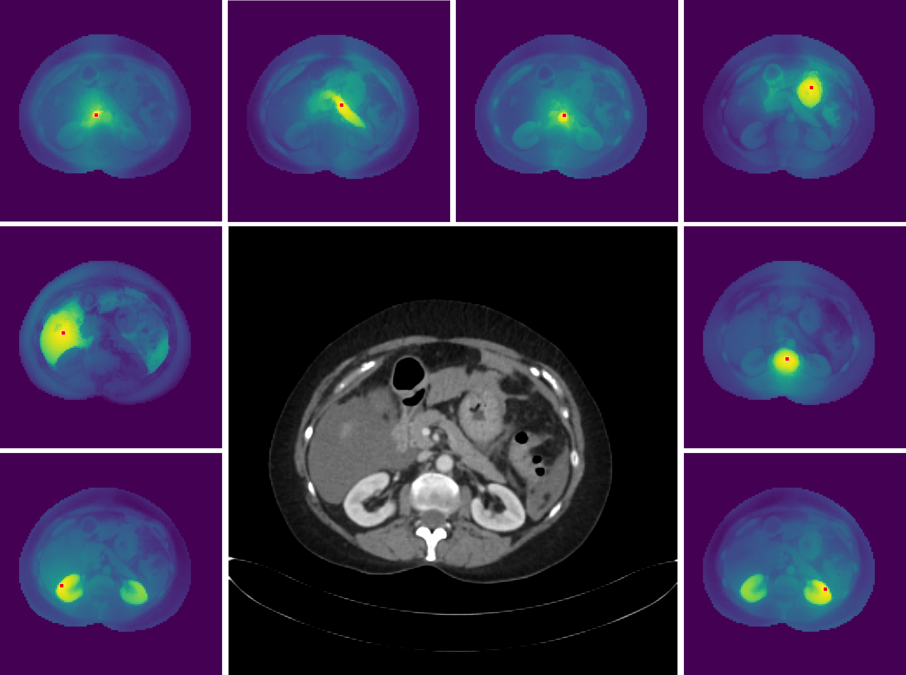

# 🩺 **MedDINOv3: Adapting Vision Foundation Models for Medical Image Segmentation**

_Work in progress._ 

Official implementation of MedDINOv3. 

MedDINOv3 is a simple yet powerful framework that adapts DINOv3, a state-of-the-art vision foundation model, to the medical imaging domain. By combining a plain ViT backbone with multi-scale token aggregation and domain-adaptive pretraining on CT-3M (3.87M slices), MedDINOv3 achieves state-of-the-art or comparable performance on four diverse segmentation benchmarks (AMOS22, BTCV, KiTS23, LiTS).

## Overview
<p align="center">
  
</p>
<p align="center">
  <em>Figure: High-resolution dense features of MedDINOv3. We visualize the cosine similarity maps between the patches
marked with a red dot and all other patches. Input image at 2048 × 2048. </em>
</p>

## 📦 Pretrained Models

### 🔹 MedDINOv3 pretrained on CT-3M
 | Backbone | Pretraining Dataset   | Download |
|----------|-----------------------|----------|
 | ViT-B/16 | CT-3M (3.87M slices) | [[link](https://drive.google.com/file/d/1_MgctUnIIFcQJCVOhkcs84qq92hlqXVA/view?usp=sharing)] |

---
## ⚙️ Installation
### 1. Clone the repository
```bash
git clone https://github.com/ricklisz/MedDINOv3.git
cd MedDINOv3
```
### 2. Create environment
```bash
cd nnUNet
conda env create -f environment.yml -n dinov3
conda activate dinov3
```
### or using pip
```bash
pip install -r requirements.txt
```
### 3. Local Installation
Once the environment is ready, install the package in editable mode:
```bash
pip install -e .
```
### 4. Using deformable modules
```bash
cd nnUNet/nnunetv2/training/nnUNetTrainer/dinov3/dinov3/eval/segmentation/models/utils/ops
pip install .
```
## 🦖 Finetuning DINOv3 within nnUNet

###  1. 📂 Dataset Preparation
Please follow the nnU-Net dataset format. Each dataset should be structured as:
```bash /path/to/dataset/
├── imagesTr/
│   ├── case001_0000.nii.gz
│   └── ...
├── labelsTr/
│   ├── case001.nii.gz
│   └── ...
└── dataset.json
```
Set environment variables for nnU-Net:
```bash 
export nnUNet_raw="/path/to/raw_data"
export nnUNet_preprocessed="/path/to/preprocessed_data"
export nnUNet_results="/path/to/model_results"
```

### 2. Locate the dinov3Trainer in 
```bash
nnUNet/nnunetv2/training/nnUNetTrainer/dinov3Trainer.py
```
Specify DINOv3 checkpoint paths in :
```python
@staticmethod
def build_network_architecture(patch_size: tuple, 
                                architecture_class_name: str,
                                arch_init_kwargs: dict,
                                arch_init_kwargs_req_import: Union[List[str], Tuple[str, ...]],
                                num_input_channels: int,
                                num_output_channels: int,
                                enable_deep_supervision: bool = True) -> nn.Module:

    from nnunetv2.training.nnUNetTrainer.dinov3.dinov3.models.vision_transformer import vit_base
    # Initialize model
    model = vit_base(drop_path_rate=0.2, layerscale_init=1.0e-05, n_storage_tokens=4, 
                        qkv_bias = False, mask_k_bias= True)
    # Load checkpoint
    chkpt = torch.load(
        YOUR_PATH_TO_CHECKPOINT,
        map_location='cpu'
    )
    state_dict = chkpt['teacher']
    state_dict = {
        k.replace('backbone.', ''): v
        for k, v in state_dict.items()
        if 'ibot' not in k and 'dino_head' not in k
    }
    missing, unexpected = model.load_state_dict(state_dict, strict=True)

    from nnunetv2.training.nnUNetTrainer.dinov3.dinov3.models.primus import Primus_Multiscale
    primus = Primus_Multiscale(embed_dim=768, patch_embed_size=16, num_classes=num_output_channels, 
                                dino_encoder=model, interaction_indices=[2,5,8,11])
    return primus
```
### 3. 🚀 Training
#### Our MedDINOv3:
```bash
nnUNetv2_train dataset_id 2d 0 -tr meddinov3_base_primus_multiscale_Trainer
``` 

#### Training with original DINOv3 checkpoint:
```bash
nnUNetv2_train dataset_id 2d 0 -tr dinov3_base_primus_multiscale_Trainer
``` 

#### 2D nnUNet:
 ```bash
nnUNetv2_train dataset_id 2d 0
``` 

#### 2D SegFormer:
 ```bash
nnUNetv2_train dataset_id 2d 0 -tr segformerTrainer
``` 

#### 2D Dino UNet:
 ```bash
nnUNetv2_train dataset_id 2d 0 -tr dinoUNetTrainer
``` 

### 3. Calculate metrics:
 ```bash
python nnUNet/nnunetv2/compute_metrics.py
``` 

## 🌟 Tricks for you to reproduce our results
### Add a new 2d config so that the patch size is 896 x 896. 
Go to the nnUNetPlans.json, add something like this:
 ```
        "2d_896": {
            "inherits_from": "2d",
            "data_identifier": "nnUNetPlans_2d_896",
            "preprocessor_name": "DefaultPreprocessor",
            "patch_size": [
                896,
                896
            ],
            "spacing": [
                0.4464285714285714,
                0.4464285714285714
            ]
        }
```
Derive the spacing from the original 2d spacing. We use a formula like this:
```
new_spacing = original_spacing * (original_patch_size / 896)
```
Rerun the preprocessing
``` bash
nnUNetv2_plan_and_preprocess -d dataset_id -c 2d_896
```
## 📖 Citation

If you find this work useful, please cite:
``` 
@article{li2025meddinov3,
  title={MedDINOv3: How to Adapt Vision Foundation Models for Medical Image Segmentation?},
  author={Li, Yuheng and Wu, Yizhou and Lai, Yuxiang and Hu, Mingzhe and Yang, Xiaofeng},
  journal={arXiv preprint arXiv:2509.xxxxx},
  year={2025},
  url={https://arxiv.org/abs/2509.xxxxx}
}
```
## 🙏 Acknowledgements

This project builds on:

nnU-Net https://github.com/MIC-DKFZ/nnUNet

DINOv3 https://github.com/facebookresearch/dinov3